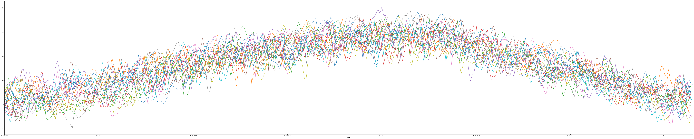

# Budapest Időjárás 2000-2020 elemzés

Data analysis and visualisation with pandas  
https://www.shanelynn.ie/analysis-of-weather-data-using-pandas-python-and-seaborn/

https://darksky.net/dev/docs


```python
import glob
import time
from datetime import datetime
from pathlib import Path

import matplotlib as plt
import seaborn as sns
import numpy as np
import pandas as pd
import os
%matplotlib inline
```


```python
IN_DIR = Path("/home/xunguist/Budapest_idojaras_2010-2020/BP_years")
```

## Read and parse raw data

#### Create custom parsers and define datetime columns


```python
def custom_date_parser(x: str) -> datetime:
    ""
    try:
        x = datetime.strptime(x, "%Y-%m-%d %H:%M")
        return x
    except TypeError:
        return np.NaN
    
def custom_int_parser(x: str) -> int:
    ""
    try:
        x = np.int64(x)
        return x
    except (TypeError,ValueError):
        return np.NaN

datetime_cols = ["time", "sunriseTime", "temperatureLowTime",
                 "precipIntensityMaxTime", "temperatureHighTime",
                 "apparentTemperatureHighTime", "apparentTemperatureLowTime",
                 "temperatureMinTime", "temperatureMaxTime",
                 "apparentTemperatureMinTime", "apparentTemperatureMaxTime"]
```

####  Iterate over INDIR and collect data into a single pd dataframe


```python
all_years = pd.DataFrame()

for file in IN_DIR.glob("*.csv"):
    year_df = pd.read_csv(file, 
                          parse_dates=datetime_cols,
                          date_parser=custom_date_parser,
                          converters={"uvIndex":custom_int_parser})
    all_years = all_years.append(year_df)
```


```python
all_years.info()
```

    <class 'pandas.core.frame.DataFrame'>
    Int64Index: 7669 entries, 0 to 365
    Data columns (total 37 columns):
    Unnamed: 0                     7669 non-null int64
    time                           7669 non-null datetime64[ns]
    summary                        7420 non-null object
    sunriseTime                    7669 non-null datetime64[ns]
    moonPhase                      7669 non-null float64
    precipIntensity                5089 non-null float64
    precipIntensityMax             5089 non-null float64
    precipIntensityMaxTime         1870 non-null datetime64[ns]
    precipProbability              5088 non-null float64
    precipType                     3721 non-null object
    temperatureHigh                7664 non-null float64
    temperatureHighTime            7664 non-null datetime64[ns]
    temperatureLow                 7666 non-null float64
    temperatureHigh.1              7664 non-null float64
    temperatureLowTime             7666 non-null datetime64[ns]
    apparentTemperatureHigh        7664 non-null float64
    apparentTemperatureHighTime    7664 non-null datetime64[ns]
    apparentTemperatureLowTime     7666 non-null datetime64[ns]
    apparentTemperatureLow         7666 non-null float64
    dewPoint                       7669 non-null float64
    humidity                       7669 non-null float64
    pressure                       7313 non-null float64
    windSpeed                      7669 non-null float64
    windGust                       5262 non-null float64
    windBearing                    7669 non-null int64
    cloudCover                     7436 non-null float64
    uvIndex                        7655 non-null float64
    visibility                     4782 non-null float64
    ozone                          613 non-null float64
    temperatureMin                 7669 non-null float64
    temperatureMinTime             7669 non-null datetime64[ns]
    temperatureMaxTime             7669 non-null datetime64[ns]
    temperatureMax                 7669 non-null float64
    apparentTemperatureMin         7669 non-null float64
    apparentTemperatureMinTime     7669 non-null datetime64[ns]
    apparentTemperatureMax         7669 non-null float64
    apparentTemperatureMaxTime     7669 non-null datetime64[ns]
    dtypes: datetime64[ns](11), float64(22), int64(2), object(2)
    memory usage: 2.2+ MB


####  Rename, cast, drop and reindex


```python
all_years.rename({"time":"date"}, 
                 axis=1, 
                 inplace=True)
all_years.loc[:,"date"] = pd.to_datetime(all_years["date"])
all_years.loc[:,"sunriseTime"] = pd.to_datetime(all_years["sunriseTime"])
all_years.loc[:,"temperatureHighTime"] = pd.to_datetime(all_years["temperatureHighTime"])
all_years.loc[:,"temperatureLowTime"] = pd.to_datetime(all_years["temperatureLowTime"])

all_years.loc[:,"year"] = all_years["date"].dt.year
all_years.loc[:,"month"] = all_years["date"].dt.month
all_years.loc[:,"day"] = all_years["date"].dt.day
all_years.loc[:,"dayofweek"] = all_years["date"].dt.dayofweek

all_years.drop(["Unnamed: 0", "temperatureHigh.1"], 
               axis=1, 
               inplace=True)

all_years.index = all_years["date"].dt.strftime("%Y-%m-%d")
```


```python
all_years.info()
```

    <class 'pandas.core.frame.DataFrame'>
    Index: 7669 entries, 2000-01-01 to 2020-12-31
    Data columns (total 39 columns):
    date                           7669 non-null datetime64[ns]
    summary                        7420 non-null object
    sunriseTime                    7669 non-null datetime64[ns]
    moonPhase                      7669 non-null float64
    precipIntensity                5089 non-null float64
    precipIntensityMax             5089 non-null float64
    precipIntensityMaxTime         1870 non-null datetime64[ns]
    precipProbability              5088 non-null float64
    precipType                     3721 non-null object
    temperatureHigh                7664 non-null float64
    temperatureHighTime            7664 non-null datetime64[ns]
    temperatureLow                 7666 non-null float64
    temperatureLowTime             7666 non-null datetime64[ns]
    apparentTemperatureHigh        7664 non-null float64
    apparentTemperatureHighTime    7664 non-null datetime64[ns]
    apparentTemperatureLowTime     7666 non-null datetime64[ns]
    apparentTemperatureLow         7666 non-null float64
    dewPoint                       7669 non-null float64
    humidity                       7669 non-null float64
    pressure                       7313 non-null float64
    windSpeed                      7669 non-null float64
    windGust                       5262 non-null float64
    windBearing                    7669 non-null int64
    cloudCover                     7436 non-null float64
    uvIndex                        7655 non-null float64
    visibility                     4782 non-null float64
    ozone                          613 non-null float64
    temperatureMin                 7669 non-null float64
    temperatureMinTime             7669 non-null datetime64[ns]
    temperatureMaxTime             7669 non-null datetime64[ns]
    temperatureMax                 7669 non-null float64
    apparentTemperatureMin         7669 non-null float64
    apparentTemperatureMinTime     7669 non-null datetime64[ns]
    apparentTemperatureMax         7669 non-null float64
    apparentTemperatureMaxTime     7669 non-null datetime64[ns]
    year                           7669 non-null int64
    month                          7669 non-null int64
    day                            7669 non-null int64
    dayofweek                      7669 non-null int64
    dtypes: datetime64[ns](11), float64(21), int64(5), object(2)
    memory usage: 2.3+ MB


#### Check for missing data 


```python
null_df = pd.DataFrame(all_years.isnull().sum(), columns=["null count"])
null_df["null %"] = round(null_df["null count"] / len(all_years)*100, 2)
null_df.sort_values(by="null count", ascending=False)
```


<div>
<style scoped>
    .dataframe tbody tr th:only-of-type {
        vertical-align: middle;
    }

    .dataframe tbody tr th {
        vertical-align: top;
    }

    .dataframe thead th {
        text-align: right;
    }
</style>
<table border="1" class="dataframe">
  <thead>
    <tr style="text-align: right;">
      <th></th>
      <th>null count</th>
      <th>null %</th>
    </tr>
  </thead>
  <tbody>
    <tr>
      <th>ozone</th>
      <td>7056</td>
      <td>92.01</td>
    </tr>
    <tr>
      <th>precipIntensityMaxTime</th>
      <td>5799</td>
      <td>75.62</td>
    </tr>
    <tr>
      <th>precipType</th>
      <td>3948</td>
      <td>51.48</td>
    </tr>
    <tr>
      <th>visibility</th>
      <td>2887</td>
      <td>37.65</td>
    </tr>
    <tr>
      <th>precipProbability</th>
      <td>2581</td>
      <td>33.65</td>
    </tr>
    <tr>
      <th>precipIntensity</th>
      <td>2580</td>
      <td>33.64</td>
    </tr>
    <tr>
      <th>precipIntensityMax</th>
      <td>2580</td>
      <td>33.64</td>
    </tr>
    <tr>
      <th>windGust</th>
      <td>2407</td>
      <td>31.39</td>
    </tr>
    <tr>
      <th>pressure</th>
      <td>356</td>
      <td>4.64</td>
    </tr>
    <tr>
      <th>summary</th>
      <td>249</td>
      <td>3.25</td>
    </tr>
    <tr>
      <th>cloudCover</th>
      <td>233</td>
      <td>3.04</td>
    </tr>
    <tr>
      <th>uvIndex</th>
      <td>14</td>
      <td>0.18</td>
    </tr>
    <tr>
      <th>apparentTemperatureHigh</th>
      <td>5</td>
      <td>0.07</td>
    </tr>
    <tr>
      <th>apparentTemperatureHighTime</th>
      <td>5</td>
      <td>0.07</td>
    </tr>
    <tr>
      <th>temperatureHighTime</th>
      <td>5</td>
      <td>0.07</td>
    </tr>
    <tr>
      <th>temperatureHigh</th>
      <td>5</td>
      <td>0.07</td>
    </tr>
    <tr>
      <th>apparentTemperatureLowTime</th>
      <td>3</td>
      <td>0.04</td>
    </tr>
    <tr>
      <th>apparentTemperatureLow</th>
      <td>3</td>
      <td>0.04</td>
    </tr>
    <tr>
      <th>temperatureLowTime</th>
      <td>3</td>
      <td>0.04</td>
    </tr>
    <tr>
      <th>temperatureLow</th>
      <td>3</td>
      <td>0.04</td>
    </tr>
    <tr>
      <th>temperatureMaxTime</th>
      <td>0</td>
      <td>0.00</td>
    </tr>
    <tr>
      <th>year</th>
      <td>0</td>
      <td>0.00</td>
    </tr>
    <tr>
      <th>apparentTemperatureMaxTime</th>
      <td>0</td>
      <td>0.00</td>
    </tr>
    <tr>
      <th>apparentTemperatureMax</th>
      <td>0</td>
      <td>0.00</td>
    </tr>
    <tr>
      <th>apparentTemperatureMinTime</th>
      <td>0</td>
      <td>0.00</td>
    </tr>
    <tr>
      <th>month</th>
      <td>0</td>
      <td>0.00</td>
    </tr>
    <tr>
      <th>day</th>
      <td>0</td>
      <td>0.00</td>
    </tr>
    <tr>
      <th>apparentTemperatureMin</th>
      <td>0</td>
      <td>0.00</td>
    </tr>
    <tr>
      <th>temperatureMax</th>
      <td>0</td>
      <td>0.00</td>
    </tr>
    <tr>
      <th>date</th>
      <td>0</td>
      <td>0.00</td>
    </tr>
    <tr>
      <th>temperatureMinTime</th>
      <td>0</td>
      <td>0.00</td>
    </tr>
    <tr>
      <th>temperatureMin</th>
      <td>0</td>
      <td>0.00</td>
    </tr>
    <tr>
      <th>windBearing</th>
      <td>0</td>
      <td>0.00</td>
    </tr>
    <tr>
      <th>windSpeed</th>
      <td>0</td>
      <td>0.00</td>
    </tr>
    <tr>
      <th>humidity</th>
      <td>0</td>
      <td>0.00</td>
    </tr>
    <tr>
      <th>dewPoint</th>
      <td>0</td>
      <td>0.00</td>
    </tr>
    <tr>
      <th>moonPhase</th>
      <td>0</td>
      <td>0.00</td>
    </tr>
    <tr>
      <th>sunriseTime</th>
      <td>0</td>
      <td>0.00</td>
    </tr>
    <tr>
      <th>dayofweek</th>
      <td>0</td>
      <td>0.00</td>
    </tr>
  </tbody>
</table>
</div>


#### Drop above 50%


```python
all_years.drop(['precipType', 'ozone','precipIntensityMaxTime'], 
               axis=1,
               inplace=True)
```

#### Plot


```python
all_years.columns
```


    Index(['date', 'summary', 'sunriseTime', 'moonPhase', 'precipIntensity',
           'precipIntensityMax', 'precipProbability', 'temperatureHigh',
           'temperatureHighTime', 'temperatureLow', 'temperatureLowTime',
           'apparentTemperatureHigh', 'apparentTemperatureHighTime',
           'apparentTemperatureLowTime', 'apparentTemperatureLow', 'dewPoint',
           'humidity', 'pressure', 'windSpeed', 'windGust', 'windBearing',
           'cloudCover', 'uvIndex', 'visibility', 'temperatureMin',
           'temperatureMinTime', 'temperatureMaxTime', 'temperatureMax',
           'apparentTemperatureMin', 'apparentTemperatureMinTime',
           'apparentTemperatureMax', 'apparentTemperatureMaxTime', 'year', 'month',
           'day', 'dayofweek'],
          dtype='object')


```python
for year in all_years["year"].unique():
    all_years[all_years["year"] == year]["temperatureHigh"].plot(figsize=(100,20))
    #ax = all_years[all_years["year"] == year]["temperatureHigh"].plot(figsize=(100,20))
    
#fig = ax.get_figure()
#fig.savefig(IN_DIR/'windSpeed_figure.pdf')
```

    /home/xunguist/anaconda3/lib/python3.7/site-packages/pandas/plotting/_matplotlib/core.py:1182: UserWarning: FixedFormatter should only be used together with FixedLocator
      ax.set_xticklabels(xticklabels)





```python
#More to come
```
