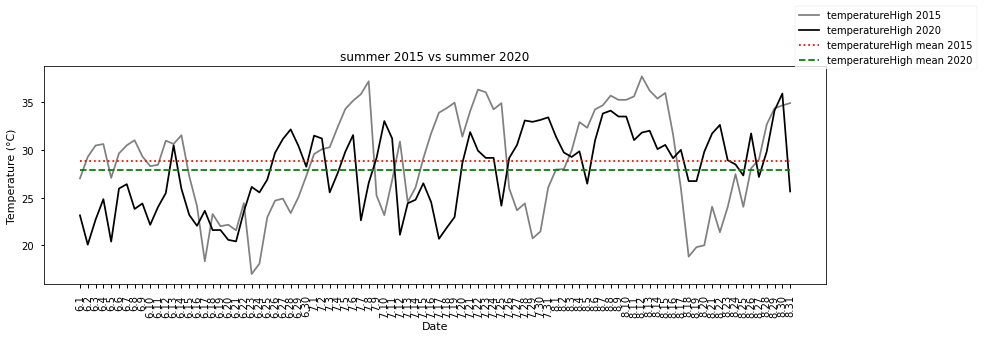
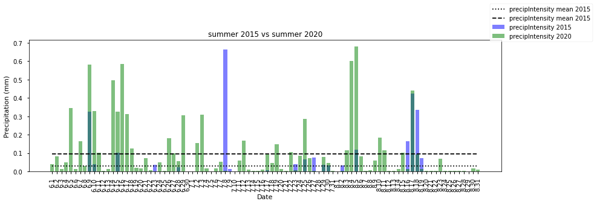

# Budapest Weather 2000-2020 analysis

#### Data Source: 
https://darksky.net/dev


#### Data Description: 
https://darksky.net/dev/docs  
Data is in SI units as follows:

* summary: Any summaries containing temperature or snow accumulation units will have their values in degrees
  Celsius or in centimeters (respectively).
* nearestStormDistance: Kilometers.
* precipIntensity: Millimeters per hour.
* precipIntensityMax: Millimeters per hour.
* temperature: Degrees Celsius.
* temperatureMin: Degrees Celsius.
* temperatureMax: Degrees Celsius.
* apparentTemperature: Degrees Celsius.
* dewPoint: Degrees Celsius.
* windSpeed: Meters per second.
* windGust: Meters per second.
* pressure: Hectopascals.
* visibility: Kilometers.


```python
import glob
import time
from datetime import datetime
from pathlib import Path

import numpy as np
import pandas as pd
import os
```


```python
IN_DIR = Path("/home/xunguist/Budapest_idojaras_2010-2020/BP_years")
```

## Read and parse raw data

#### Create custom parsers and define datetime columns


```python
def custom_date_parser(x: str) -> datetime:
    ""
    try:
        x = datetime.strptime(x, "%Y-%m-%d %H:%M")
        return x
    except TypeError:
        return np.NaN
    
def custom_int_parser(x: str) -> int:
    ""
    try:
        x = np.int64(x)
        return x
    except (TypeError,ValueError):
        return np.NaN

datetime_cols = ["time", "sunriseTime", "temperatureLowTime",
                 "precipIntensityMaxTime", "temperatureHighTime",
                 "apparentTemperatureHighTime", "apparentTemperatureLowTime",
                 "temperatureMinTime", "temperatureMaxTime",
                 "apparentTemperatureMinTime", "apparentTemperatureMaxTime"]
```

####  Iterate over INDIR and collect data into a single pd dataframe


```python
all_years = pd.DataFrame()

for file in IN_DIR.glob("*.csv"):
    year_df = pd.read_csv(file, 
                          parse_dates=datetime_cols,
                          date_parser=custom_date_parser,
                          converters={"uvIndex":custom_int_parser})
    all_years = all_years.append(year_df)
```


```python
all_years.info()
```

    <class 'pandas.core.frame.DataFrame'>
    Int64Index: 7669 entries, 0 to 365
    Data columns (total 37 columns):
    Unnamed: 0                     7669 non-null int64
    time                           7669 non-null datetime64[ns]
    summary                        7420 non-null object
    sunriseTime                    7669 non-null datetime64[ns]
    moonPhase                      7669 non-null float64
    precipIntensity                5089 non-null float64
    precipIntensityMax             5089 non-null float64
    precipIntensityMaxTime         1870 non-null datetime64[ns]
    precipProbability              5088 non-null float64
    precipType                     3721 non-null object
    temperatureHigh                7664 non-null float64
    temperatureHighTime            7664 non-null datetime64[ns]
    temperatureLow                 7666 non-null float64
    temperatureHigh.1              7664 non-null float64
    temperatureLowTime             7666 non-null datetime64[ns]
    apparentTemperatureHigh        7664 non-null float64
    apparentTemperatureHighTime    7664 non-null datetime64[ns]
    apparentTemperatureLowTime     7666 non-null datetime64[ns]
    apparentTemperatureLow         7666 non-null float64
    dewPoint                       7669 non-null float64
    humidity                       7669 non-null float64
    pressure                       7313 non-null float64
    windSpeed                      7669 non-null float64
    windGust                       5262 non-null float64
    windBearing                    7669 non-null int64
    cloudCover                     7436 non-null float64
    uvIndex                        7655 non-null float64
    visibility                     4782 non-null float64
    ozone                          613 non-null float64
    temperatureMin                 7669 non-null float64
    temperatureMinTime             7669 non-null datetime64[ns]
    temperatureMaxTime             7669 non-null datetime64[ns]
    temperatureMax                 7669 non-null float64
    apparentTemperatureMin         7669 non-null float64
    apparentTemperatureMinTime     7669 non-null datetime64[ns]
    apparentTemperatureMax         7669 non-null float64
    apparentTemperatureMaxTime     7669 non-null datetime64[ns]
    dtypes: datetime64[ns](11), float64(22), int64(2), object(2)
    memory usage: 2.2+ MB


####  Rename, cast, drop and reindex


```python
all_years.rename({"time":"date"}, 
                 axis=1, 
                 inplace=True)
all_years.loc[:,"date"] = pd.to_datetime(all_years["date"])
all_years.loc[:,"sunriseTime"] = pd.to_datetime(all_years["sunriseTime"])
all_years.loc[:,"temperatureHighTime"] = pd.to_datetime(all_years["temperatureHighTime"])
all_years.loc[:,"temperatureLowTime"] = pd.to_datetime(all_years["temperatureLowTime"])

all_years.loc[:,"year"] = all_years["date"].dt.year
all_years.loc[:,"month"] = all_years["date"].dt.month
all_years.loc[:,"day"] = all_years["date"].dt.day
all_years.loc[:,"dayofweek"] = all_years["date"].dt.dayofweek

all_years.drop(["Unnamed: 0", "temperatureHigh.1"], 
               axis=1, 
               inplace=True)

all_years.index = all_years["date"].dt.strftime("%Y-%m-%d")
```


```python
all_years.info()
```

    <class 'pandas.core.frame.DataFrame'>
    Index: 7669 entries, 2000-01-01 to 2020-12-31
    Data columns (total 39 columns):
    date                           7669 non-null datetime64[ns]
    summary                        7420 non-null object
    sunriseTime                    7669 non-null datetime64[ns]
    moonPhase                      7669 non-null float64
    precipIntensity                5089 non-null float64
    precipIntensityMax             5089 non-null float64
    precipIntensityMaxTime         1870 non-null datetime64[ns]
    precipProbability              5088 non-null float64
    precipType                     3721 non-null object
    temperatureHigh                7664 non-null float64
    temperatureHighTime            7664 non-null datetime64[ns]
    temperatureLow                 7666 non-null float64
    temperatureLowTime             7666 non-null datetime64[ns]
    apparentTemperatureHigh        7664 non-null float64
    apparentTemperatureHighTime    7664 non-null datetime64[ns]
    apparentTemperatureLowTime     7666 non-null datetime64[ns]
    apparentTemperatureLow         7666 non-null float64
    dewPoint                       7669 non-null float64
    humidity                       7669 non-null float64
    pressure                       7313 non-null float64
    windSpeed                      7669 non-null float64
    windGust                       5262 non-null float64
    windBearing                    7669 non-null int64
    cloudCover                     7436 non-null float64
    uvIndex                        7655 non-null float64
    visibility                     4782 non-null float64
    ozone                          613 non-null float64
    temperatureMin                 7669 non-null float64
    temperatureMinTime             7669 non-null datetime64[ns]
    temperatureMaxTime             7669 non-null datetime64[ns]
    temperatureMax                 7669 non-null float64
    apparentTemperatureMin         7669 non-null float64
    apparentTemperatureMinTime     7669 non-null datetime64[ns]
    apparentTemperatureMax         7669 non-null float64
    apparentTemperatureMaxTime     7669 non-null datetime64[ns]
    year                           7669 non-null int64
    month                          7669 non-null int64
    day                            7669 non-null int64
    dayofweek                      7669 non-null int64
    dtypes: datetime64[ns](11), float64(21), int64(5), object(2)
    memory usage: 2.3+ MB


#### Check for missing data 


```python
null_df = pd.DataFrame(all_years.isnull().sum(), columns=["null count"])
null_df["null %"] = round(null_df["null count"] / len(all_years)*100, 2)
null_df.sort_values(by="null count", ascending=False)
```


<div>
<style scoped>
    .dataframe tbody tr th:only-of-type {
        vertical-align: middle;
    }

    .dataframe tbody tr th {
        vertical-align: top;
    }

    .dataframe thead th {
        text-align: right;
    }
</style>
<table border="1" class="dataframe">
  <thead>
    <tr style="text-align: right;">
      <th></th>
      <th>null count</th>
      <th>null %</th>
    </tr>
  </thead>
  <tbody>
    <tr>
      <th>ozone</th>
      <td>7056</td>
      <td>92.01</td>
    </tr>
    <tr>
      <th>precipIntensityMaxTime</th>
      <td>5799</td>
      <td>75.62</td>
    </tr>
    <tr>
      <th>precipType</th>
      <td>3948</td>
      <td>51.48</td>
    </tr>
    <tr>
      <th>visibility</th>
      <td>2887</td>
      <td>37.65</td>
    </tr>
    <tr>
      <th>precipProbability</th>
      <td>2581</td>
      <td>33.65</td>
    </tr>
    <tr>
      <th>precipIntensity</th>
      <td>2580</td>
      <td>33.64</td>
    </tr>
    <tr>
      <th>precipIntensityMax</th>
      <td>2580</td>
      <td>33.64</td>
    </tr>
    <tr>
      <th>windGust</th>
      <td>2407</td>
      <td>31.39</td>
    </tr>
    <tr>
      <th>pressure</th>
      <td>356</td>
      <td>4.64</td>
    </tr>
    <tr>
      <th>summary</th>
      <td>249</td>
      <td>3.25</td>
    </tr>
    <tr>
      <th>cloudCover</th>
      <td>233</td>
      <td>3.04</td>
    </tr>
    <tr>
      <th>uvIndex</th>
      <td>14</td>
      <td>0.18</td>
    </tr>
    <tr>
      <th>apparentTemperatureHigh</th>
      <td>5</td>
      <td>0.07</td>
    </tr>
    <tr>
      <th>apparentTemperatureHighTime</th>
      <td>5</td>
      <td>0.07</td>
    </tr>
    <tr>
      <th>temperatureHighTime</th>
      <td>5</td>
      <td>0.07</td>
    </tr>
    <tr>
      <th>temperatureHigh</th>
      <td>5</td>
      <td>0.07</td>
    </tr>
    <tr>
      <th>apparentTemperatureLowTime</th>
      <td>3</td>
      <td>0.04</td>
    </tr>
    <tr>
      <th>apparentTemperatureLow</th>
      <td>3</td>
      <td>0.04</td>
    </tr>
    <tr>
      <th>temperatureLowTime</th>
      <td>3</td>
      <td>0.04</td>
    </tr>
    <tr>
      <th>temperatureLow</th>
      <td>3</td>
      <td>0.04</td>
    </tr>
    <tr>
      <th>temperatureMaxTime</th>
      <td>0</td>
      <td>0.00</td>
    </tr>
    <tr>
      <th>year</th>
      <td>0</td>
      <td>0.00</td>
    </tr>
    <tr>
      <th>apparentTemperatureMaxTime</th>
      <td>0</td>
      <td>0.00</td>
    </tr>
    <tr>
      <th>apparentTemperatureMax</th>
      <td>0</td>
      <td>0.00</td>
    </tr>
    <tr>
      <th>apparentTemperatureMinTime</th>
      <td>0</td>
      <td>0.00</td>
    </tr>
    <tr>
      <th>month</th>
      <td>0</td>
      <td>0.00</td>
    </tr>
    <tr>
      <th>day</th>
      <td>0</td>
      <td>0.00</td>
    </tr>
    <tr>
      <th>apparentTemperatureMin</th>
      <td>0</td>
      <td>0.00</td>
    </tr>
    <tr>
      <th>temperatureMax</th>
      <td>0</td>
      <td>0.00</td>
    </tr>
    <tr>
      <th>date</th>
      <td>0</td>
      <td>0.00</td>
    </tr>
    <tr>
      <th>temperatureMinTime</th>
      <td>0</td>
      <td>0.00</td>
    </tr>
    <tr>
      <th>temperatureMin</th>
      <td>0</td>
      <td>0.00</td>
    </tr>
    <tr>
      <th>windBearing</th>
      <td>0</td>
      <td>0.00</td>
    </tr>
    <tr>
      <th>windSpeed</th>
      <td>0</td>
      <td>0.00</td>
    </tr>
    <tr>
      <th>humidity</th>
      <td>0</td>
      <td>0.00</td>
    </tr>
    <tr>
      <th>dewPoint</th>
      <td>0</td>
      <td>0.00</td>
    </tr>
    <tr>
      <th>moonPhase</th>
      <td>0</td>
      <td>0.00</td>
    </tr>
    <tr>
      <th>sunriseTime</th>
      <td>0</td>
      <td>0.00</td>
    </tr>
    <tr>
      <th>dayofweek</th>
      <td>0</td>
      <td>0.00</td>
    </tr>
  </tbody>
</table>
</div>


#### Drop columns where above 50% is missing


```python
all_years.drop(['precipType', 'ozone','precipIntensityMaxTime'], 
               axis=1,
               inplace=True)
```

### Extreme Weather

#### Highest Temperature max


```python
all_years[all_years["temperatureMax"] == all_years["temperatureMax"].max()][["temperatureMax"]]
```


<div>
<style scoped>
    .dataframe tbody tr th:only-of-type {
        vertical-align: middle;
    }

    .dataframe tbody tr th {
        vertical-align: top;
    }

    .dataframe thead th {
        text-align: right;
    }
</style>
<table border="1" class="dataframe">
  <thead>
    <tr style="text-align: right;">
      <th></th>
      <th>temperatureMax</th>
    </tr>
    <tr>
      <th>date</th>
      <th></th>
    </tr>
  </thead>
  <tbody>
    <tr>
      <th>2007-07-20</th>
      <td>40.44</td>
    </tr>
  </tbody>
</table>
</div>


```python
temperatureMax_mean = all_years["temperatureMax"].mean()
f"mean: {temperatureMax_mean:.2f}"
```


    'mean: 16.39'


#### Lowest Temperature low


```python
all_years[all_years["temperatureMin"] == all_years["temperatureMin"].min()][["temperatureMin"]]
```


<div>
<style scoped>
    .dataframe tbody tr th:only-of-type {
        vertical-align: middle;
    }

    .dataframe tbody tr th {
        vertical-align: top;
    }

    .dataframe thead th {
        text-align: right;
    }
</style>
<table border="1" class="dataframe">
  <thead>
    <tr style="text-align: right;">
      <th></th>
      <th>temperatureMin</th>
    </tr>
    <tr>
      <th>date</th>
      <th></th>
    </tr>
  </thead>
  <tbody>
    <tr>
      <th>2003-01-13</th>
      <td>-20.61</td>
    </tr>
  </tbody>
</table>
</div>


```python
temperatureMin_mean = round(all_years["temperatureMin"].mean(), 1)
f"mean: {temperatureMin_mean:.2f}"
```


    'mean: 7.20'


#### Highest windSpeed (m/s)


```python
all_years[all_years["windSpeed"] == all_years["windSpeed"].max()][["windSpeed"]]
```


<div>
<style scoped>
    .dataframe tbody tr th:only-of-type {
        vertical-align: middle;
    }

    .dataframe tbody tr th {
        vertical-align: top;
    }

    .dataframe thead th {
        text-align: right;
    }
</style>
<table border="1" class="dataframe">
  <thead>
    <tr style="text-align: right;">
      <th></th>
      <th>windSpeed</th>
    </tr>
    <tr>
      <th>date</th>
      <th></th>
    </tr>
  </thead>
  <tbody>
    <tr>
      <th>2018-10-24</th>
      <td>9.66</td>
    </tr>
  </tbody>
</table>
</div>


```python
windSpeed_mean = round(all_years["windSpeed"].mean(), 1)
f"mean: {windSpeed_mean:.2f}"
```


    'mean: 2.30'


## Plotting data


```python
import matplotlib.pyplot as plt
plt.style.use('seaborn-notebook')

%matplotlib
%matplotlib inline
```

    Using matplotlib backend: Qt5Agg


### Comparing same periods of different years


```python
all_years["month_day"] = all_years["date"].dt.month.astype(str) \
+ "." + all_years["date"].dt.day.astype(str)
```


```python
year1 = '2015'
year2 = '2020'

start_period = '06-01'
end_period = '08-31'

year_1_df = all_years[f'{year1}-{start_period}': f'{year1}-{end_period}'].copy()
year_2_df = all_years[f'{year2}-{start_period}': f'{year2}-{end_period}'].copy()
```


```python
year1_th_null_values = year_1_df["temperatureHigh"].isnull().sum()
year1_th_null_values = year_2_df["temperatureHigh"].isnull().sum()
print(f"{year1} count of null values: {year1_th_null_values}")
print(f"{year2} count of null values: {year1_th_null_values}")
```

    2015 count of null values: 0
    2020 count of null values: 0


### Comparing Temperature Highs


```python
year_1_temp_high_mean = year_1_df["temperatureHigh"].mean()
year_2_temp_high_mean = year_2_df["temperatureHigh"].mean()

print(f"{year1} summer temperatureHigh mean: {year_1_temp_high_mean:.2f} C")
print(f"{year2} summer temperatureHigh mean: {year_2_temp_high_mean:.2f} C")
```

    2015 summer temperatureHigh mean: 28.83 C
    2020 summer temperatureHigh mean: 27.83 C


```python
fig = plt.figure(figsize=(14,4))
ax = plt.axes()
ax.plot(year_1_df["month_day"],
        year_1_df["temperatureHigh"], 
         '-', 
         color='grey',
         label=f'temperatureHigh {year1}'
        )
ax.plot(year_2_df["month_day"],
        year_2_df["temperatureHigh"], 
         '-', 
         color='black',
         label=f'temperatureHigh {year2}'
        )

ax.plot([year_1_temp_high_mean] * len(year_1_df),
        ":",
        color='red',
        label=f'temperatureHigh mean {year1}'
       )

ax.plot([year_2_temp_high_mean] * len(year_2_df),
        "--",
        color='green',
        label=f'temperatureHigh mean {year2}'
       )

ax.tick_params(axis='x', rotation=90)

ax.set(title=f"summer {year1} vs summer {year2}",
       xlabel='Date', 
       ylabel='Temperature (°C)')


ax.legend(bbox_to_anchor=(1.2, 1.3))
```


    <matplotlib.legend.Legend at 0x7f2af158f350>





### Comparing Temperature Lows


```python
year1_tl_null_values = year_1_df["temperatureLow"].isnull().sum()
year2_tl_null_values = year_2_df["temperatureLow"].isnull().sum()
print(f"{year1} count of null values: {year1_tl_null_values}")
print(f"{year2} count of null values: {year2_tl_null_values}")
```

    2015 count of null values: 0
    2020 count of null values: 0


```python
year_1_temp_low_mean = year_1_df["temperatureLow"].mean()
year_2_temp_low_mean = year_2_df["temperatureLow"].mean()

print(f"{year1} summer temperatureLow mean: {year_1_temp_low_mean:.2f} C")
print(f"{year2} summer temperatureLow mean: {year_2_temp_low_mean:.2f} C")
```

    2015 summer temperatureLow mean: 16.99 C
    2020 summer temperatureLow mean: 18.27 C


```python
fig = plt.figure(figsize=(14,4))
ax = plt.axes()
ax.plot(year_1_df["month_day"],
        year_1_df["temperatureLow"], 
         '-', 
         color='grey',
         label=f'temperatureLow {year1}'
        )
ax.plot(year_2_df["month_day"],
        year_2_df["temperatureLow"], 
         '-', 
         color='black',
         label=f'temperatureLow {year2}'
        )

ax.plot([year_1_temp_low_mean] * len(year_1_df),
        ":",
        color='red',
        label=f'temperatureLow mean {year1}'
       )

ax.plot([year_2_temp_low_mean] * len(year_2_df),
        "--",
        color='green',
        label=f'temperatureLow mean {year2}'
       )

ax.tick_params(axis='x', rotation=90)

ax.set(title=f"summer {year1} vs summer {year2}",
       xlabel='Date', 
       ylabel='Temperature (°C)')


ax.legend(bbox_to_anchor=(1.2, 1.3))
```


    <matplotlib.legend.Legend at 0x7f2ae93b7110>


### Comparing precipIntensity

precipIntensity measure unit: Millimeters per hour


```python
all_years["precipIntensity"].describe()
```


    count    5089.000000
    mean        0.060715
    std         0.395774
    min         0.000000
    25%         0.000000
    50%         0.000000
    75%         0.008300
    max        11.334000
    Name: precipIntensity, dtype: float64


```python
year1_pi_null_values = year_1_df["precipIntensity"].isnull().sum()
year2_pi_null_values = year_2_df["precipIntensity"].isnull().sum()
print(f"{year1} count of null values: {year1_tl_null_values}")
print(f"{year2} count of null values: {year2_tl_null_values}")
```

    2015 count of null values: 0
    2020 count of null values: 0


```python
year_1_precipIntensity_mean = year_1_df["precipIntensity"].mean()
year_2_precipIntensity_mean = year_2_df["precipIntensity"].mean()

print(f"{year1} summer precipIntensity mean: {year_1_precipIntensity_mean:.2f} Millimeters per hour")
print(f"{year2} summer precipIntensity mean: {year_2_precipIntensity_mean:.2f} Millimeters per hour")
```

    2015 summer precipIntensity mean: 0.03 Millimeters per hour
    2020 summer precipIntensity mean: 0.10 Millimeters per hour


```python
fig = plt.figure(figsize=(14,4))
ax = plt.axes()
ax.bar(year_1_df["month_day"], 
       year_1_df["precipIntensity"],
       color='blue',
       label=f'precipIntensity {year1}',
       alpha=0.5
       )

ax.bar(year_2_df["month_day"], 
       year_2_df["precipIntensity"],
       color='green',
       label=f'precipIntensity {year2}',
       alpha=0.5
       )

ax.plot([year_1_precipIntensity_mean] * len(year_1_df),
        ":",
        color='black',
        label=f'precipIntensity mean {year1}'
       )

ax.plot([year_2_precipIntensity_mean] * len(year_2_df),
        "--",
        color='black',
        label=f'precipIntensity mean {year1}'
       )

ax.tick_params(axis='x',rotation=90)

ax.set(title=f"summer {year1} vs summer {year2}",
       xlabel='Date', 
       ylabel='Precipitation (mm)')

ax.legend(bbox_to_anchor=(1.2, 1.3))
```


    <matplotlib.legend.Legend at 0x7f2ae8071fd0>





### Plotting Range


```python
year_1_df = all_years[f'{year1}-{start_period}': f'{year1}-{end_period}'].copy()
year_2_df = all_years[f'{year2}-{start_period}': f'{year2}-{end_period}'].copy()
```


```python
year_1_df["temp_range"] = year_1_df["temperatureHigh"] - year_1_df["temperatureLow"]
```


```python
fig = plt.figure(figsize=(14,4))
ax = plt.axes()

ax.plot(year_1_df["month_day"],
        year_1_df["temperatureHigh"], 
         '-', 
         color='red',
         label=f'temperatureHigh {year1}'
        )

ax.plot(year_1_df["month_day"],
        year_1_df["temperatureLow"], 
         '-', 
         color='blue',
         label=f'temperatureLow {year1}'
        )

plt.fill_between(year_1_df["month_day"],
                 year_1_df["temperatureHigh"],
                 year_1_df["temperatureLow"], 
                 color="yellow",
                 alpha=0.3)

ax.tick_params(axis='x', rotation=90)

ax.set(title=f"summer {year1} temperature range",
       xlabel='Date', 
       ylabel='Temperature (°C)')


ax.legend(loc='lower right', frameon=False)
```


    <matplotlib.legend.Legend at 0x7f2ae3729fd0>


```python
plt.style.use('seaborn-notebook')

fig, ax = plt.subplots(2,figsize=(15,5))

ax[0].plot(year_1_df["month_day"],
        year_1_df["temperatureHigh"], 
         '-', 
         color='red',
         label=f'temperatureHigh {year1}'
        )

ax[0].plot(year_1_df["month_day"],
        year_1_df["temperatureLow"], 
         '-', 
         color='blue',
         label=f'temperatureLow {year1}'
        )

ax[1].bar(year_1_df["month_day"], 
       year_1_df["temp_range"],
       color='green',
       label=f'temperature range {year1}',
       alpha=0.5
       )

ax[1].plot(year_1_df["month_day"],
           [year_1_df["temp_range"].mean()] * len(year_1_df), 
           '-', 
           color='black',
           label=f'mean temperature range {year1}'
          )

ax[0].tick_params(axis='x', rotation=90)

ax[0].set(title=f"summer {year1} temperature range",
       xlabel='Date', 
       ylabel='Temperature (°C)')


ax[1].tick_params(axis='x', rotation=90)
ax[1].set(xlabel='Date', ylabel='Temperature (°C)')


ax[0].legend(loc='upper left', frameon=False)
ax[1].legend(loc='upper left', frameon=False)
```


    <matplotlib.legend.Legend at 0x7f2ae346ff10>


## [Climograph](https://en.wikipedia.org/wiki/Climograph)

A climograph is a graphical representation of a location's basic climate.  
Climographs display data for two variables:   
(a) monthly average temperature and  
(b) monthly average precipitation.  
These are useful tools to quickly describe a location's climate.   

Expected values: https://hu.wikipedia.org/wiki/Budapest  
Original Source: https://www.met.hu/  


```python
plt.style.use('seaborn-white')
```


```python
year_df = all_years["2020-01-01":"2020-12-31"].copy()

year_df.loc[:,"month_name"] = year_df.loc[:,"date"].dt.month_name()
year_average = year_df.groupby("month").mean()[["temperatureHigh","temperatureLow"]]
year_average.loc[:,"temp_average"] = (year_average.loc[:,"temperatureHigh"] \
                                      + year_average.loc[:,"temperatureLow"]) / 2
year_sum = year_df.groupby("month").sum()[["precipIntensity"]]
year_average.index = year_df["month_name"].unique()
year_sum.index = year_df["month_name"].unique()

fig = plt.figure(figsize=(14,6))
fig.patch.set_alpha(0)
ax = plt.axes()

ax.plot(year_sum.index,
        [1.1,2.0,6.5,12.8,17.0,20.4,22.5,22.9,17.0,12.1,5.4,0.9], 
         '-o', 
        color='black',
        label=f'expected average temperature {year_df.loc[:,"date"].dt.year[0]}',
        linewidth=2,
        alpha=0.6
        )

ax.plot(year_average["temp_average"], 
         '-o', 
        color='red',
        label=f'observed average temperature {year_df.loc[:,"date"].dt.year[0]}',
        linewidth=2,
        alpha=1
        )

ax2=ax.twinx()
ax2.set_ylabel('Precipitation (mm)')


ax2.bar(year_sum.index, 
       [34, 28, 31, 38, 59, 64, 45, 52, 41, 35, 49, 40],
       color='black',
       label=f'expected precipitation average (mm)',
       alpha=0.5
       )

ax2.bar(year_sum.index, 
       year_sum["precipIntensity"]*24,
       color='blue',
       label=f'observed precipitation average (mm)',
        alpha=0.6
       )

ax.tick_params(axis='x', rotation=45)

ax.set_xlabel(f'{year_df.loc[:,"date"].dt.year[0]}')
ax.set_ylabel('Temperature average(°C)')
ax.set_title(f'Budapest Climograph for {year_df.loc[:,"date"].dt.year[0]}')

l1 = ax.legend(loc='upper left', frameon=False)
l2 = ax2.legend(loc='upper right', frameon=False)

plt.setp(l1.get_texts(), color='black')
plt.setp(l2.get_texts(), color='black')

ax.grid(False)
ax2.grid(False)

plt.ylim(0, 150)
```


    (0.0, 150.0)


```python
year_average
```


<div>
<style scoped>
    .dataframe tbody tr th:only-of-type {
        vertical-align: middle;
    }

    .dataframe tbody tr th {
        vertical-align: top;
    }

    .dataframe thead th {
        text-align: right;
    }
</style>
<table border="1" class="dataframe">
  <thead>
    <tr style="text-align: right;">
      <th></th>
      <th>temperatureHigh</th>
      <th>temperatureLow</th>
      <th>temp_average</th>
    </tr>
  </thead>
  <tbody>
    <tr>
      <th>January</th>
      <td>4.255806</td>
      <td>-1.297097</td>
      <td>1.479355</td>
    </tr>
    <tr>
      <th>February</th>
      <td>10.994483</td>
      <td>3.305517</td>
      <td>7.150000</td>
    </tr>
    <tr>
      <th>March</th>
      <td>13.470000</td>
      <td>4.021935</td>
      <td>8.745968</td>
    </tr>
    <tr>
      <th>April</th>
      <td>20.085333</td>
      <td>8.468333</td>
      <td>14.276833</td>
    </tr>
    <tr>
      <th>May</th>
      <td>20.594194</td>
      <td>11.270968</td>
      <td>15.932581</td>
    </tr>
    <tr>
      <th>June</th>
      <td>24.877333</td>
      <td>16.768333</td>
      <td>20.822833</td>
    </tr>
    <tr>
      <th>July</th>
      <td>28.099032</td>
      <td>17.997097</td>
      <td>23.048065</td>
    </tr>
    <tr>
      <th>August</th>
      <td>30.425161</td>
      <td>20.005161</td>
      <td>25.215161</td>
    </tr>
    <tr>
      <th>September</th>
      <td>25.926333</td>
      <td>15.222333</td>
      <td>20.574333</td>
    </tr>
    <tr>
      <th>October</th>
      <td>17.046452</td>
      <td>9.516129</td>
      <td>13.281290</td>
    </tr>
    <tr>
      <th>November</th>
      <td>9.701667</td>
      <td>3.902667</td>
      <td>6.802167</td>
    </tr>
    <tr>
      <th>December</th>
      <td>6.974194</td>
      <td>2.500645</td>
      <td>4.737419</td>
    </tr>
  </tbody>
</table>
</div>


```python

```
